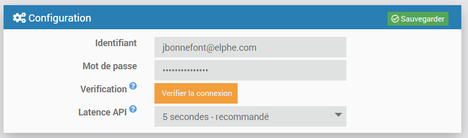
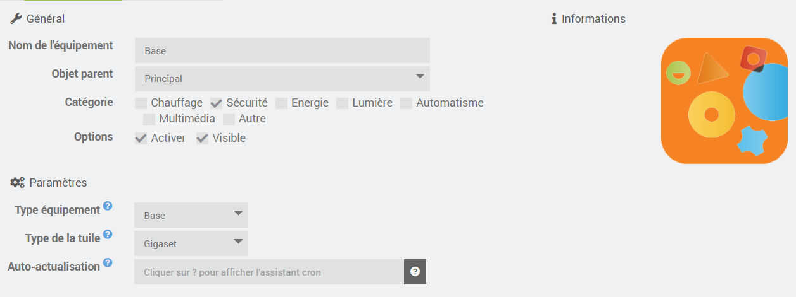
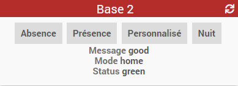

# "Gigaset Elements" plugin documentation

This plugin allows to connect to the "Gigaset Elements" system to fetch status and enable/disable alarm

Plugin configuration
====================

After downloading the plugin, it needs to be activated, then the Gigaset credential information must be entered
- user login / password.
- Gigaset API latency. 

>**IMPORTANT**
>
> the Gigaset API is not very reactive (public REST API), hence a 5 second latency is recommended.

Device configuration
====================

Devie creation is done manually at this time (the automatic sync is not ready yet...)

Several device types are available

> **base** : this is the Gigaset gateway, allowing to show the alarm widget on the dashboard
The base can be displayed using the Gigaset "style" as on smartphones, or with standard "core" jeedom widgets for compatibility. 
This devices behaves similarly to the "mode" plugin, but shows statuses on the Gigaset system (red/green icon, and status messages).

> **camera** : allows displaying video strem from "smart cameras" (may require camera plugin to function properly)
 -- coming soon --
 
> **sensor** : will be used for "classical" sensors (door/windows/motion...)
 -- coming soon --
 
Widget/Tile
======

The base tile is ued for alarm sync. There are 2 display variants : 

- "Gigaset" design, as on smartphones

- "Core" design, with standard Jeedom widgets

FAQ 
===

How the sync is performed ?

:   There is no webhook as far as I can see, so there is basic "polling", done each 5 minutes (cron5) except for specific events that can be refreshed more often (device configuration, coming soon...
:   the API is direct PHP. There is no Daemon or python interface

It doesn't work ! 

:   First, in order to understand what's going on, one must enable logging, at least to the "info" level. If the problem still cannot be found, the "debug" level is quite verbose that should be enough to identify yhe cause of the issue.

Greetings
===

API work is largely inspired from wonderful API python interface done by Dynastic Orpheus, available here : https://github.com/dynasticorpheus/gigasetelements-cli
