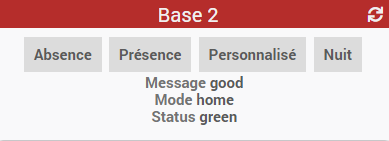

# Documentation plugin "Gigaset Elements"

Plugin permettant de se connecter au système "Gigaset Elements" pour récupérer les statuts et activer/désactiver l'alarme

Configuration du plugin
=======================

Après téléchargement du plugin, il faut l'activer, puis entrer les informations de connexion Gigaset
- user / mot de passe
- temps de latence de l'API Gigaset. 

>**IMPORTANT**
>
> l'API n'étant pas tres réactive (API REST publique), une latence de 5 secondes est recommandée.

Configuration des équipements
=============================

La création des équipements se fait de façon manuelle (pas encore de synchro automatique, a venir...)

Plusieurs types d'équipements sont disponibles

> **base** : la passerelle Gigaset, qui permettra de faire apparaitre le badge d'alarme
La base peut etre affichée avec un badge qui reprend le design mobile Gigaset, ou bien avec le widget standard Jeedom pour la compatibilité. 
L'équipement fonctionne de façon similaire au plugin "mode", mais remonte en plus des statuts sur le systeme Gigaset (picto vert/rouge, et message d'état).

> **camera** : permet d'afficher les flux sur les smart cameras (nécessite le plugin camera pour fonctionner)
 -- a venir --
 
> **capteur** : représente les capteurs "classiques" type porte/fenetre/mouvement
 -- a venir --
 
Widget/Tuile
======

La tuile de la base sert pour la synchro de l'alarme. Il y a deux variantes : 

- Design "Gigaset" avec le badge comme sur mobile

- Design "Core" avec les widgets standard Jeedom

FAQ 
===

Comment est faite la synchro ?

:   Il n'y a pas de webhook à ma connaissance, on a donc un "polling" de base, fait toutes les 5 minutes (cron5) sauf pour les évenements dont l'actualisation peut etre reglée dans la configuration de l'équipement

